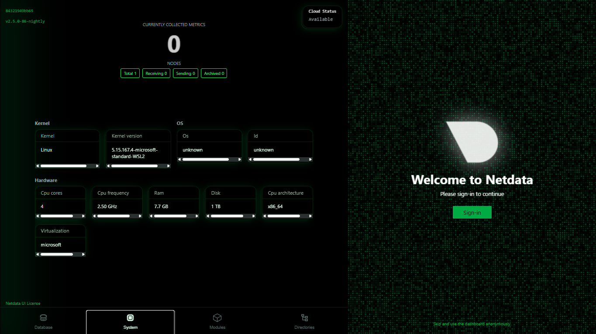

# EL_Task8_JavaMavenBuild

This repository contains a simple Java HelloWorld application built using Maven and Jenkins to demonstrate basic CI/CD.

## Project Structure
- `src/main/java/HelloWorld.java` — Java source code for HelloWorld program
- `pom.xml` — Maven configuration file

## Jenkins Setup
- Jenkins Freestyle project configured to run `mvn clean package`
- JDK and Maven configured in Jenkins Global Tool Configuration
- Build triggers: Manual build

## How to Run
1. Clone the repo:  
   `git clone https://github.com/shubhamgrover1/EL_Task8_JavaMavenBuild.git`
2. Navigate to project folder:  
   `cd EL_Task8_JavaMavenBuild`
3. Build locally (if you want):  
   `mvn clean package`
4. Run Jenkins job to automate the build

## Screenshot

## Outcome
This project demonstrates the use of Jenkins to automate the building of a Java Maven project, including understanding Jenkins jobs, build triggers, and console output reading.

---

Feel free to customize the README if you want! When ready, add this file to your repo and push it.

Want me to generate the full content ready for your repo?
